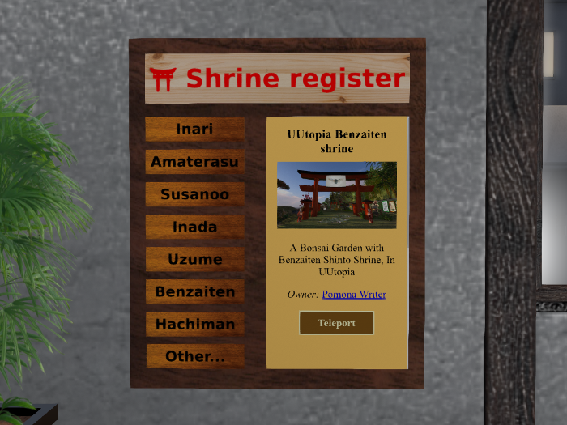

In-world board of the Second Life Shinto shrine register (SLSR)
===============================================================

About
-----
This repository contains the in-world board of the Second Life Shinto shrine register (SLSR).
**[Get it from SL Marketplace](https://marketplace.secondlife.com/p/Shrine-register-board/17914344)**

Image sources
-------------
* `kempas-wood-texture-floor-panel-stock-photo-5.jpg`: http://ambut.distributorsusukambingetawa.org/images-stock-textures.html
* `2create_wood_0014.jpg`: http://www.supertextures.co.uk/wood

License
-------
This project is free software under the terms of the GNU General Public License v3 as published by the Free Software Foundation.
It is distributed WITHOUT ANY WARRANTY (without even the implied warranty of MERCHANTABILITY or FITNESS FOR A PARTICULAR PURPOSE).
For more details please see the LICENSE file or: http://www.gnu.org/licenses

Credits
-------
* Homepage: https://www.slsr.org
* Git repository: https://github.com/sl-shinto-shrine-register/board.git
